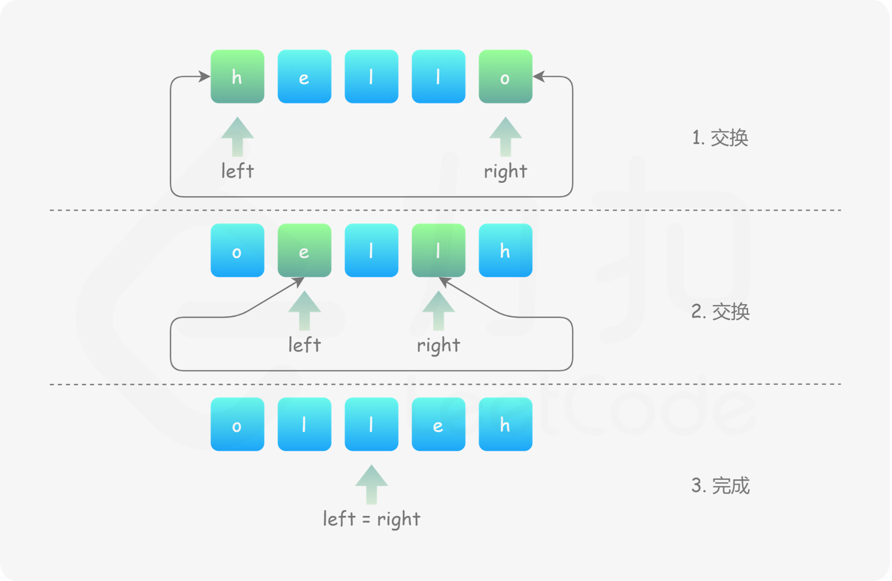

### **题目：**
https://leetcode.cn/problems/reverse-string/


### **思路：** 
方法一：直接化身API小子用到数组的reverse方法翻转
方法二：双指针


### **代码:**
**方法一：**
```js
/**
 * @param {character[]} s
 * @return {void} Do not return anything, modify s in-place instead.
 */
var reverseString = function(s) {
    return s.reverse()
};
```

**方法二：**
```js
/**
 * @param {character[]} s
 * @return {void} Do not return anything, modify s in-place instead.
 */
var reverseString = function(s) {
    const len = s.length;
    for(let left = 0, right = len - 1; left < right; left++, right--) {
        [s[left], s[right]] = [s[right], s[left]];
    }
};
```