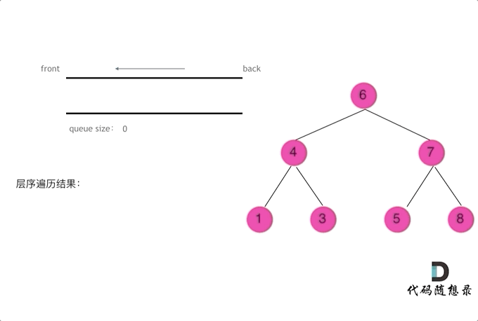

### **题目：**
https://leetcode.cn/problems/binary-tree-level-order-traversal-ii/description/


### **思路：** 
**方法一：** 遍历每一层其实就是个模板题，因为本题要求自底向上 处理的时候unshift进去即可
贴张图更清楚

**方法二：** 

### **代码:**
**方法一：**
```js
/**
 * Definition for a binary tree node.
 * function TreeNode(val, left, right) {
 *     this.val = (val===undefined ? 0 : val)
 *     this.left = (left===undefined ? null : left)
 *     this.right = (right===undefined ? null : right)
 * }
 */
/**
 * @param {TreeNode} root
 * @return {number[][]}
 */
var levelOrderBottom = function(root) {
    let res = [];
    let queue = [root];
    while(queue.length && root !== null) {
        let curLevel = [];
        let length = queue.length;
        while(length--) {
            let node = queue.shift();
            curLevel.push(node.val);
            node.left && queue.push(node.left);
            node.right && queue.push(node.right);
        }
        res.unshift(curLevel);
    }
    return res;
};
```

**方法二：**
```js

```